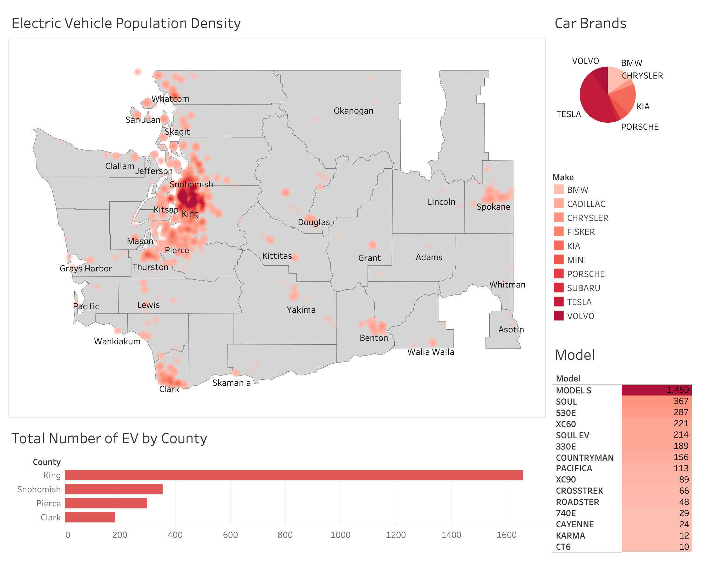

# Analyzing Electric Vehicle Adoption Patterns In Washington State

Our project analyzes electric vehicle (EV) adoption trends in Washington State. We aim
to derive insights that can help guide policy decisions, infrastructure investments, and
promote EV accessibility across various regions. The core objectives include:
• Identifying regions with high concentrations of electric vehicles.
• Exploring the variation of vehicle attributes (such as make and model) across
locations.
• Predicting regions likely to experience growth in EV adoption, based on current
trends and existing infrastructure.

#### Dataset Reference: [link](https://data.wa.gov/Transportation/Electric-Vehicle-Population-Data/f6w7-q2d2/about_data)

## Notes: 
1. **Battery Electric Vehicle (BEV)**: An all-electric vehicle using batteries to store electrical energy, powers motor, charges by plugging in.
   **Plug-in Hybrid Electric Vehicle (PHEV)**: Uses batteries for electric motor + gasoline/diesel for combustion engine, charges by plugging in.

2. **Clean Alternative Fuel Vehicle (CAFV) Eligibility**: Based on fuel and electric-range requirements (RCW 82.08.809, 82.12.809). Eligible for tax exemptions if:
   - Sold/leased after 8/1/2019
   - Meets purchase price requirements

3. Monthly vehicle counts per county may vary between reports due to improved county assignment processes.

4. Electric Range not tracked for BEVs (all new BEVs exceed 30 miles). Zero (0) entered for unresearched ranges.

## Columns:
| Column Name | Description | API Field Name | Data Type |
|------------|-------------|---------------|------------|
| VIN (1-10) | The 1st 10 characters of each vehicle's Vehicle Identification Number (VIN). | vin_1_10 | Text |
| County | This is the geographic region of a state that a vehicle's owner is listed to reside within. Vehicles registered in Washington state may be located in other states. | county | Text |
| City | The city in which the registered owner resides. | city | Text |
| State | This is the geographic region of the country associated with the record. These addresses may be located in other states. | state | Text |
| Postal Code | The 5 digit zip code in which the registered owner resides. | zip_code | Text |
| Model Year | The model year of the vehicle, determined by decoding the Vehicle Identification Number (VIN). | model_year | Text |
| Make | The manufacturer of the vehicle, determined by decoding the Vehicle Identification Number (VIN). | make | Text |
| Model | The model of the vehicle, determined by decoding the Vehicle Identification Number (VIN). | model | Text |
| Electric Vehicle Type | This distinguishes the vehicle as all electric or a plug-in hybrid. | ev_type | Text |
| Clean Alternative Fuel Vehicle (CAFV) Eligibility | This categorizes vehicle as Clean Alternative Fuel Vehicles (CAFVs) based on the fuel requirement and electric-only range requirement in House Bill 2042 as passed in the 2019 legislative session. | cafv_type | Text |
| Electric Range | Describes how far a vehicle can travel purely on its electric charge. | electric_range | Number |
| Base MSRP | This is the lowest Manufacturer's Suggested Retail Price (MSRP) for any trim level of the model in question. | base_msrp | Number |
| Legislative District | The specific section of Washington State that the vehicle's owner resides in, as represented in the state legislature. | legislative_district | Text |
| DOL Vehicle ID | Unique number assigned to each vehicle by Department of Licensing for identification purposes. | dol_vehicle_id | Text |
| Vehicle Location | The center of the ZIP Code for the registered vehicle. | geocoded_column | Point |
| Electric Utility | This is the electric power retail service territories serving the address of the registered vehicle. All ownership types for areas in Washington are included: federal, investor owned, municipal, political subdivision, and cooperative. If the address for the registered vehicle falls into an area with overlapping electric power retail service territories then a single pipe \| delimits utilities of same TYPE and a double pipe \|\| delimits utilities of different types. | electric_utility | Text |
| 2020 Census Tract | The census tract identifier is a combination of the state, county, and census tract codes as assigned by the United States Census Bureau in the 2020 census, also known as Geographic Identifier (GEOID). | _2020_census_tract | Text |

